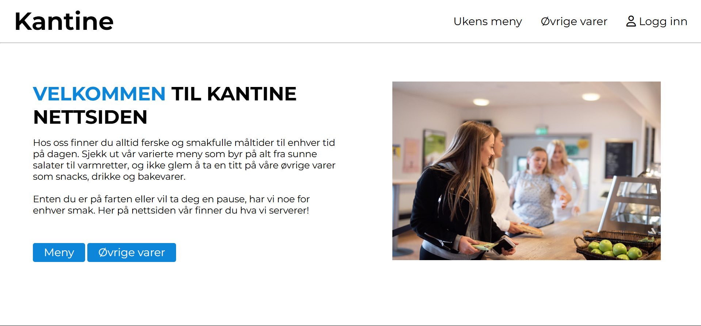
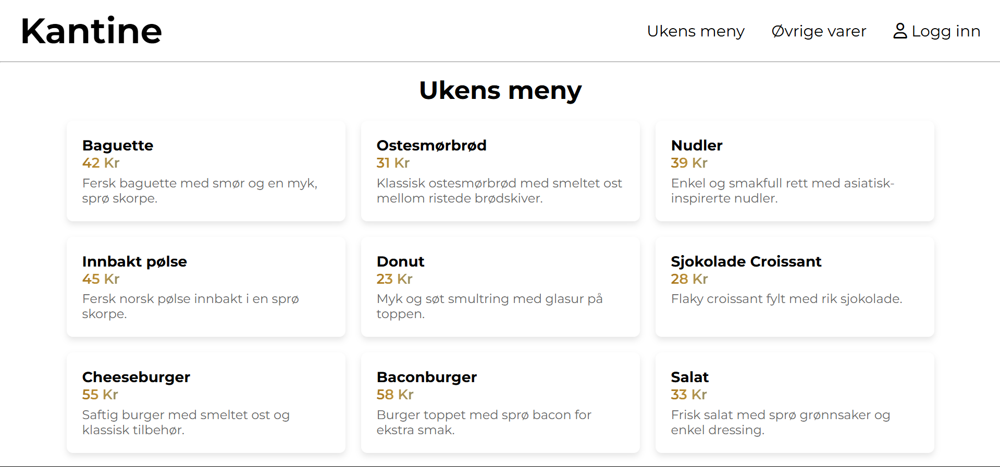
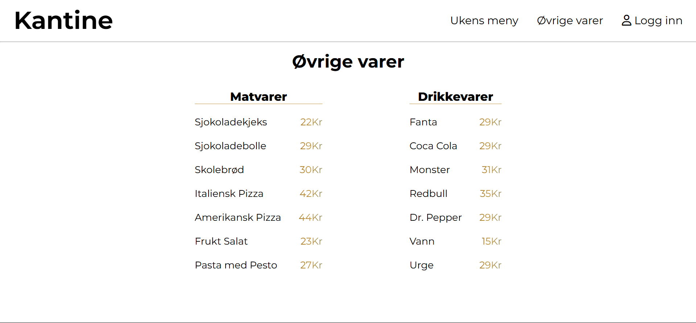
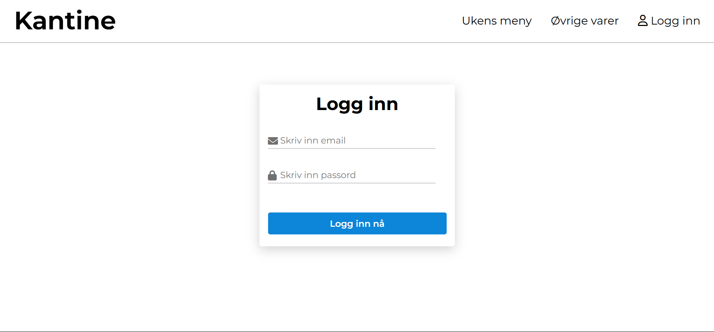
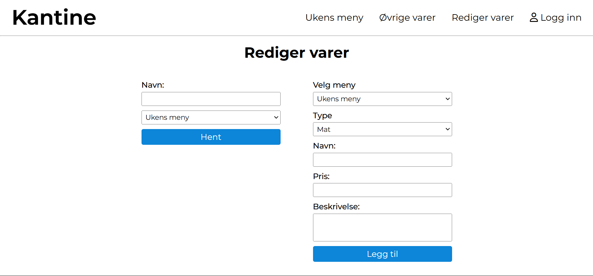

<h1 align="center">Kantine Nettside</h1>

  <h3>
    <a href="https://github.com/SanteriWille/KantineNettside">
      Lenken til prosjektet
    </a>
  </h3>

<!-- TABLE OF CONTENTS -->

## Table of Contents

- [Overview](#overview)
- [Built With](#built-with)
- [Features](#features)
- [How to use](#how-to-use)
- [Contact](#contact)

<!-- OVERVIEW -->
## Overview
Se nederst

### Built With
- [HTML](https://www.w3schools.com/html/)
- [CSS](https://www.w3schools.com/css/default.asp)
- [Javscript]
- [Firebase](https://firebase.google.com/docs/firestore)

## Features
- Dynamisk meny: Menyen lastes dynamisk fra Firebase Firestore.
- Responsiv design: Nettsiden er fullt responsiv og tilpasser seg både desktop- og mobilskjermer.
- Visning av menyartikler: Hver menyartikkel inkluderer navn, pris og beskrivelse, hentet fra Firebase.

## How To Use
HTML

div: Brukes til å strukturere menyen og annet innhold.
h1: For hovedtittelen på siden.
span: For å vise prisen.
p: For å vise beskrivelsen av hver menyartikkel.

CSS:
Flexbox for layout for å organisere menyartiklene.
Responsiv design som sikrer at siden tilpasses ulike skjermstørrelser.
Font- og farge-styling for å gi et rent og moderne utseende.

JavaScript:
Firebase Firestore integrasjon for å hente menyartikler.
DOM-manipulering for å vise hentet menydata dynamisk.

## Future Plans
Hvis jeg hadde jobbet med dette i fremtiden så vill jeg har gjort ferdig alle funksjonene. Som å kunne legge til i øvrige varer, hente og fjerne varer. Og media query.

## Contact
- Github [Santeri Wille](https://github.com/SanteriWille)
- Epost [Santeri Wille](mailto:santeriwille@gmail.com)

## Happy coding!

## Forventet resultat

